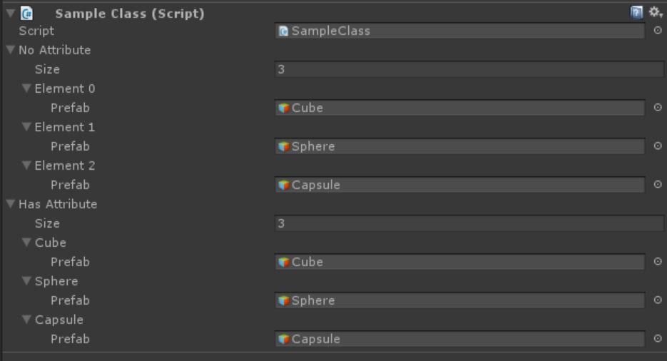

# LabelNamePropertyAttribute

```
public class SampleClass : MonoBehaviour
{
	[System.Serializable]
	public class Element
	{
		public GameObject prefab;
	}

	public Element[] NoAttribute;


	[LabelNameProperty("prefab")]
	public Element[] HasAttribute;
}

```

